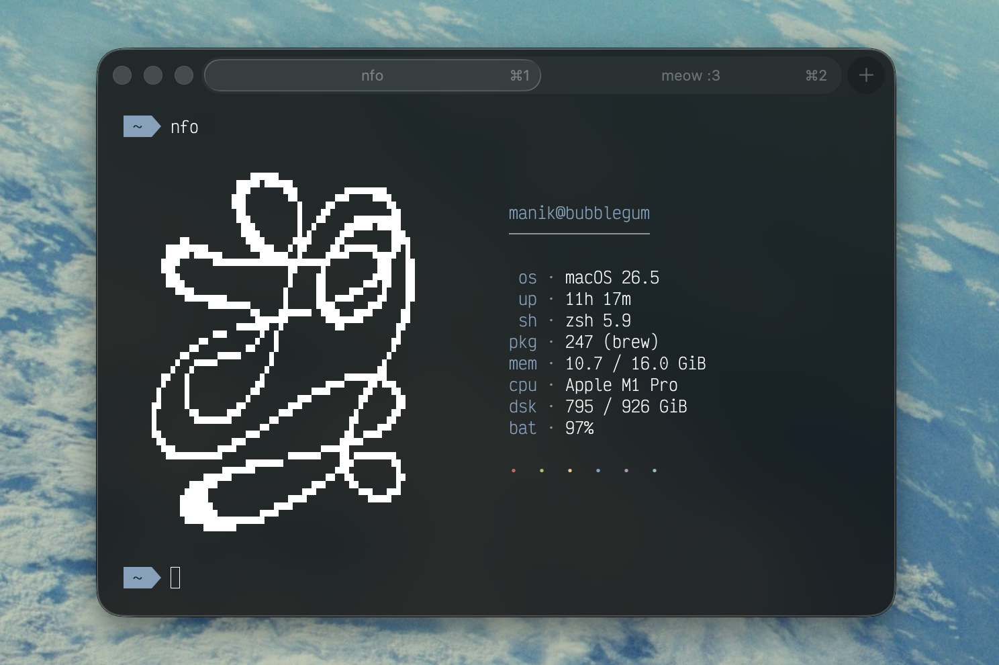

# nfo
<!-- site:strip-start -->
> Minimal fetch program with customizable ASCII art.
<!-- site:strip-end -->



## What is this

A small system fetch tool, written in Bash. Picks up the usual suspects — OS, kernel, uptime,
memory, CPU, disk, battery — and prints them next to a chunk of ASCII art. macOS and Linux.

The output is fully configurable: pick an art style, pick a tint, and reorder or drop any of
the info lines from a single function in your config.

<!-- site:strip-start -->
## Install

Homebrew:

```bash
brew install mnk400/tap/nfo
```

Manual:

```bash
cp nfo ~/.local/bin/nfo
mkdir -p ~/.config/nfo
cp -r nfo.conf art ~/.config/nfo/
chmod +x ~/.local/bin/nfo
```

Make sure `~/.local/bin` is in your `PATH`.

## Uninstall

```bash
brew uninstall nfo
# or, for manual installs:
rm ~/.local/bin/nfo && rm -rf ~/.config/nfo
```
<!-- site:strip-end -->

## Quick start

```bash
nfo
```

Config lives at `~/.config/nfo/nfo.conf`. To change what shows up, edit `INFO_ROWS`:

```bash
INFO_ROWS=(
    os
    krn
    up
    mem
    cpu
)
```

## Documentation

- [Configuration](./docs/configuration.md) — options, `INFO_ROWS`, available rows
- [Development](./docs/development.md) — dev mode, tests
